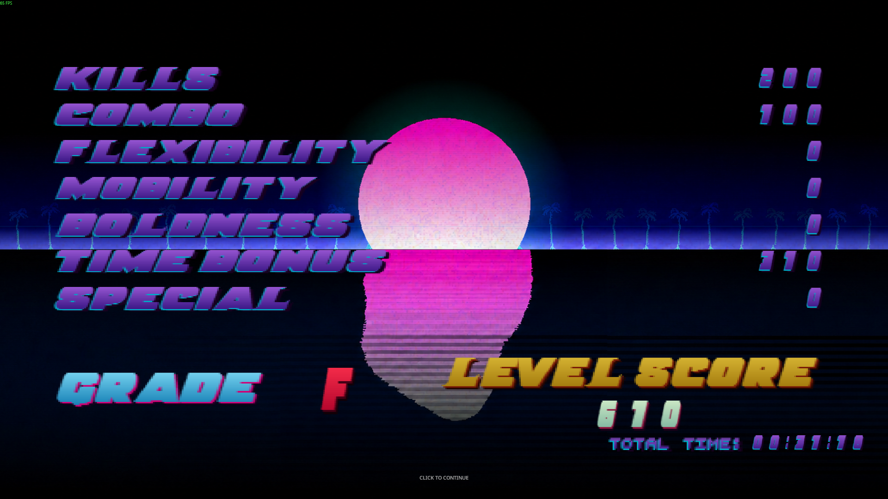

# Neon Death Grade

A personal Project Zomboid Build 42 mod inspired by Hotline Miami.

## Demo

Screenshot of the death screen:

Short video showing the player death and the death screen transition:

[Watch demo video](DeathScreenDemo.mp4)

## Features
- Custom death screen
- Score and grade system
- Combo counter UI
- UI animations and positioning
- Gameplay scoring categories
- Sound and visual feedback

## My role
I designed the concept, gameplay requirements and UI behavior.

I tested implementations, identified bugs, adjusted mechanics and iterated on the mod based on in-game results.

The technical implementation was created with extensive AI assistance.

## Tech
- Lua
- Project Zomboid Build 42
- AI-assisted development

## Status
Prototype / work in progress.
